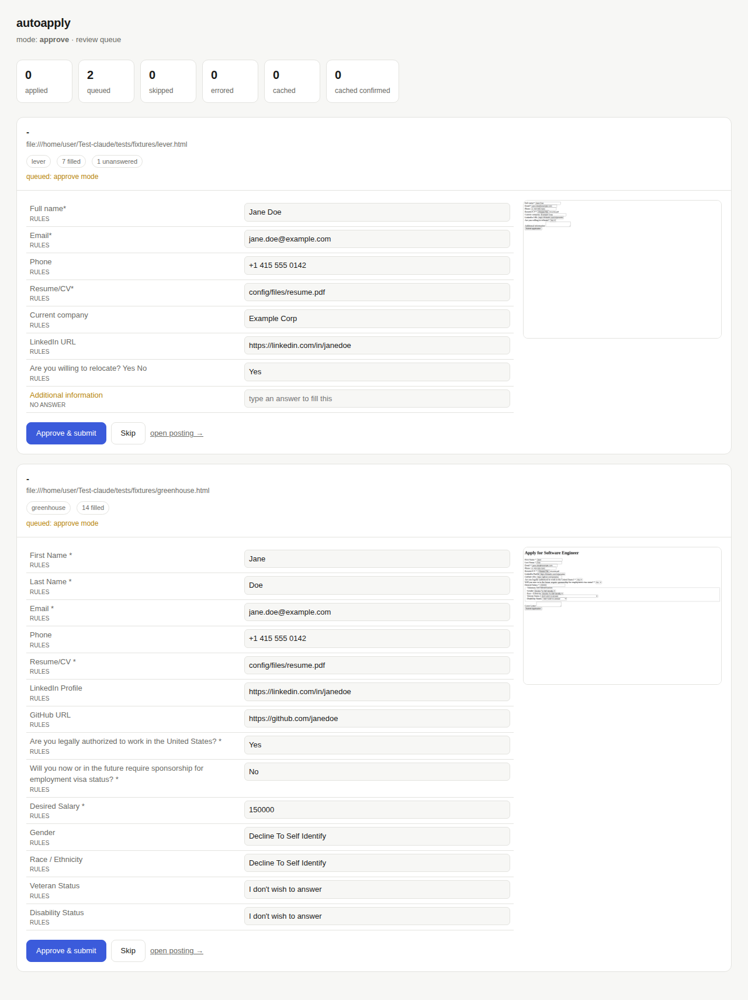

# autoapply

Give it a job link. It opens the application, fills every field it can answer
from your profile, verifies what it typed actually landed, and then either
submits it or puts it in a review queue for you.

```bash
python -m autoapply apply https://jobs.lever.co/acme/1234
```



## Status

Working prototype. Greenhouse and Lever are supported end to end (discover →
fill → verify → gate → submit → confirm → log). Workday, Ashby, iCIMS and
unknown ATSs are detected and skipped rather than guessed at — the agent path
that would handle them isn't built yet.

## Setup

```bash
pip install -r requirements.txt
playwright install chromium

cp .env.example .env
cp config/profile.example.json config/profile.json   # then fill it in
# put your resume where profile.files.resume points
```

`config/profile.json` is gitignored and holds all your PII. Nothing else needs
editing to get started — the default mapper needs no API key.

## The two modes

| Mode | Behaviour |
|---|---|
| `approve` (default) | Fills everything, submits nothing. Every application waits in the queue. |
| `auto` | Fills everything and submits, unless the gate blocks it. |

```bash
python -m autoapply apply <url>                 # uses MODE from .env
python -m autoapply apply <url> --mode auto
python -m autoapply apply <url> --dry-run       # fill + verify, never submit
python -m autoapply queue                       # what's waiting
python -m autoapply stats
```

## What blocks an auto-submit

Only things that make the submission *wrong*, not things that are merely
unreviewed:

- a **required field nothing could answer** — from the profile, the cache, a
  learned answer, or the LLM
- **verification failed** — what we typed isn't what's on the form
- a **CAPTCHA** is on the page — the run can't proceed unattended
- the **daily cap** (`DAILY_SUBMIT_CAP`) or the kill switch (`touch data/STOP`)

Sensitive fields — work authorization, sponsorship, demographics, salary — are
deliberately *not* in that list. They fill from the explicit answers in your
profile. Anything your profile doesn't answer is already caught by the
required-field rule above.

## Dashboard

```bash
python dashboard/app.py          # http://127.0.0.1:8000
```

Each queued application shows the filled values, anything left unanswered, and
a screenshot of the real form. Edit any value inline and hit **Approve &
submit** — it re-drives the form with your edits and submits. Your edits are
remembered: a typed answer is reused the next time the same question appears on
that ATS.

It binds to loopback. The queue holds your PII, screenshots of filled forms, and
your application history — don't expose it without putting auth in front.

## LLM providers

The default (`LLM_PROVIDER=rules`) makes **no network calls at all**: Greenhouse
and Lever field labels are standardized enough that deterministic matching
handles them. A model is only consulted for fields the rules can't place.

```
LLM_PROVIDER=rules       # default, no key needed
LLM_PROVIDER=anthropic   # ANTHROPIC_API_KEY
LLM_PROVIDER=openai      # OPENAI_API_KEY, OPENAI_BASE_URL
LLM_PROVIDER=ollama      # OLLAMA_HOST — nothing leaves the box
```

## Architecture

```
url → router → worker.discover → mapper → worker.fill → verify → gate → submit | queue
                                    ↑                                        ↓
                                  cache ←──────── learned corrections ───────┘
```

| Module | Job |
|---|---|
| `router.py` | URL → ATS. A data table; adding an ATS is one line. |
| `mapper.py` | Field → value: rules, then cache, then learned answers, then LLM. |
| `workers/` | DOM work. `base.py` holds discovery/fill/submit; per-ATS files hold selectors. |
| `verify.py` | Deterministic readback of every field we set. No LLM. |
| `gate.py` | The only place that decides submit vs queue. |
| `store.py` | sqlite: applied log, mapping cache, queue, corrections. |

## Tests

```bash
python -m pytest tests/ -q
```

The e2e tests drive the real pipeline against local fixtures that mimic
Greenhouse and Lever, including a **React-style controlled input** — a filler
that sets `el.value` directly fails those tests, which is the bug the native
setter in `workers/base.py` exists to avoid.

## Docker

```bash
docker compose run --rm worker apply <url>
docker compose up dashboard
```

## Not built yet

Scraping and job matching (this takes a link you supply), the browser-use agent
path for unknown ATSs, the Workday wizard worker, Gmail-based verification codes
and account creation, and the live CAPTCHA handoff.
